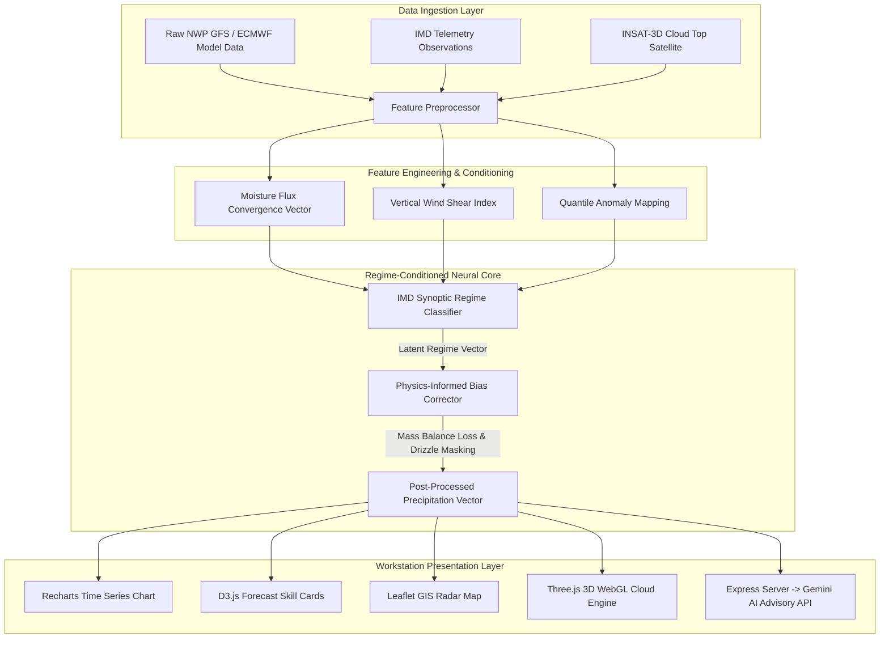
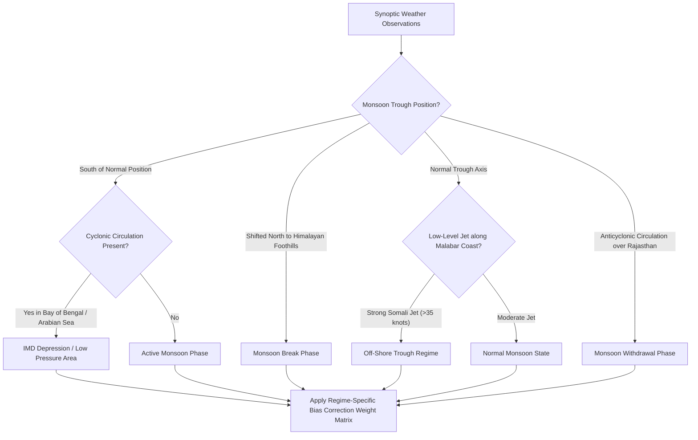
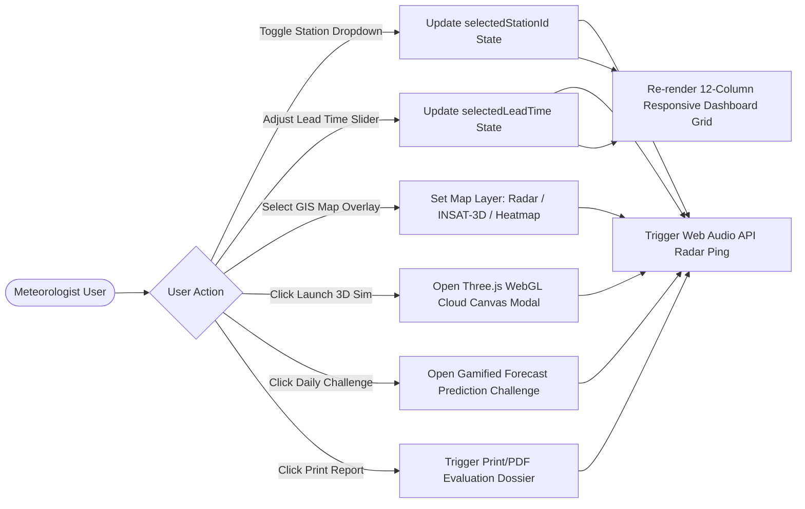
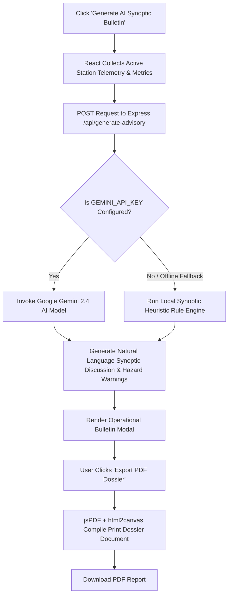
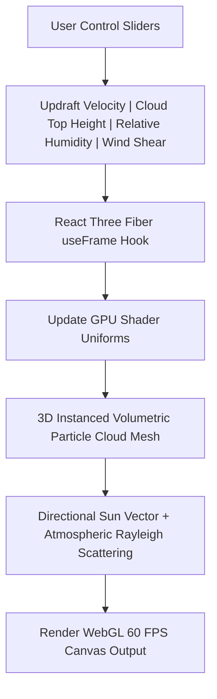

# 🌧️ SAMVARTAKA AI — Physics-Informed Monsoon Rainfall Post-Processor

[](https://www.typescriptlang.org/)
[](https://react.dev/)
[](https://tailwindcss.com/)
[](https://vitejs.dev/)
[](https://expressjs.com/)
[](https://ai.google.dev/)

> **SAMVARTAKA AI** is an operational meteorological workstation and physics-informed machine learning post-processor designed to correct numerical weather prediction (NWP) drizzle bias and accurately resolve heavy convective rainfall extremes across Indian monsoon observatories.

---

## 📋 Table of Contents

- [Overview & Architecture](#-overview--architecture)
- [Tech Stack & Dependencies](#-tech-stack--dependencies)
- [How It Works & Pipeline Flowcharts](#-how-it-works--pipeline-flowcharts)
  - [1. End-to-End System Data Flowchart](#1-end-to-end-system-data-flowchart)
  - [2. IMD Synoptic Regime Classification Flowchart](#2-imd-synoptic-regime-classification-flowchart)
  - [3. Workstation User Navigation & State Flowchart](#3-workstation-user-navigation--state-flowchart)
  - [4. AI Advisory Generation & PDF Export Flowchart](#4-ai-advisory-generation--pdf-export-flowchart)
  - [5. 3D WebGL Cloud Physics Simulation Pipeline Flowchart](#5-3d-webgl-cloud-physics-simulation-pipeline-flowchart)
- [Detailed Guide to Navigation, Options & Features](#-detailed-guide-to-navigation-options--features)
  - [1. Workstation Navigation Rail](#1-workstation-navigation-rail)
  - [2. Interactive Scenario Scrubber Bar](#2-interactive-scenario-scrubber-bar)
  - [3. Real-Time Telemetry & Metric Scorecards](#3-real-time-telemetry--metric-scorecards)
  - [4. Live GIS Observatory Map & Remote Sensing Layers](#4-live-gis-observatory-map--remote-sensing-layers)
  - [5. Time Series Forecast & D3 Skill Visualizer](#5-time-series-forecast--d3-skill-visualizer)
  - [6. IMD Synoptic Regime Breakdown](#6-imd-synoptic-regime-breakdown)
  - [7. Meteorological Observatories Grid](#7-meteorological-observatories-grid)
  - [8. 3D WebGL Atmospheric Simulator](#8-3d-webgl-atmospheric-simulator)
  - [9. Daily Monsoon Challenge & Achievements](#9-daily-monsoon-challenge--achievements)
  - [10. ML Architecture & Training Guide](#10-ml-architecture--training-guide)
  - [11. Advisory Bulletin & PDF Evaluation Dossier](#11-advisory-bulletin--pdf-evaluation-dossier)
- [Project Directory Structure](#-project-directory-structure)
- [Getting Started & Local Development](#-getting-started--local-development)
  - [Prerequisites](#prerequisites)
  - [Installation](#installation)
  - [Environment Variables](#environment-variables)
  - [Available Scripts](#available-scripts)
- [License](#-license)

---

## 🌐 Live Deployment

- **Application URL**: [https://sih26080-monsoon-rainfall-post-proc.vercel.app/](https://sih26080-monsoon-rainfall-post-proc.vercel.app/)


---  

## 🔬 Overview & Architecture

Raw Numerical Weather Prediction (NWP) models frequently suffer from two persistent systematic errors during the Indian Summer Monsoon (ISM):
1. **Drizzle Bias**: Over-forecasting light rain days with false precipitation frequencies.
2. **Convective Extreme Smoothing**: Under-forecasting localized heavy-to-extreme rainfall events due to coarse spatial grid resolutions.

**SAMVARTAKA AI** addresses these defects using a **Regime-Conditioned Neural Network Architecture**:
- Classifies daily synoptic atmospheric patterns into India Meteorological Department (IMD) regimes (*Active Monsoon*, *Monsoon Break*, *Off-shore Trough*, *Depression / Low Pressure Area*, *Monsoon Withdrawal*).
- Applies physics-informed constraint loss functions that preserve water mass balance while sharpening peak convective thresholds.
- Delivers real-time operational post-processed forecasts across key meteorological observatories across India.

---

## 🛠️ Tech Stack & Dependencies

### Core Languages & Frameworks
- **TypeScript 5.8**: Strictly typed application architecture across frontend and backend.
- **React 19**: Component-based UI engine powering reactive state, memoization, and interactive hooks.
- **Node.js & Express 4.21**: Server framework serving API endpoints and proxying AI requests.

### User Interface & Styling
- **Tailwind CSS v4**: Utility-first CSS engine for responsive workstation layouts, glassmorphic panels, and cybernetic color themes.
- **Motion (Framer Motion 12)**: Fluid layout transitions, spring animations, and card spotlight effects.
- **Lucide React**: Vector icons for meteorological telemetry, radar status, and navigation controls.

### Data Visualization & GIS Mapping
- **D3.js 7**: Mathematical visualization engine powering custom skill score scatter plots, quantile-quantile distribution curves, and diagnostic graphs.
- **Recharts 3**: Interactive SVG charting for multi-season time-series rainfall comparisons and lead-time decay graphs.
- **Leaflet & React-Leaflet 5**: GIS engine for rendering observatory markers, regional boundaries, Doppler radar reflectivity overlays, and INSAT-3D satellite imagery.
- **Three.js & React Three Fiber (`@react-three/fiber` & `@react-three/drei`)**: WebGL rendering engine powering real-time 3D volumetric cloud physics simulations.

### AI Integration
- **Google GenAI SDK (`@google/genai`)**: Server-side integration with Google Gemini AI models for automatic synoptic diagnostic reasoning and meteorological advisory generation.

### Document Export & Audio Utilities
- **jsPDF & html2canvas / html-to-image**: Client-side document compiler for generating printable IMD evaluation dossiers and high-resolution chart snapshots.
- **Web Audio Synthesizer**: Custom Web Audio API synthesizer (`weatherSynth`) producing radar scan pings and audio feedback cues.

---

## ⚙️ How It Works & Pipeline Flowcharts

### 1. End-to-End System Data Flowchart



```
┌─────────────────────────────────────────────────────────────────────────────┐
│                       SAMVARTAKA AI SYSTEM FLOW                             │
└─────────────────────────────────────────────────────────────────────────────┘
                                       │
            ┌──────────────────────────┴──────────────────────────┐
            ▼                                                     ▼
  [ Raw NWP Model Output ]                             [ Synoptic Observations ]
  (GFS / ECMWF Drizzle Data)                          (IMD Telemetry / INSAT-3D)
            │                                                     │
            └──────────────────────────┬──────────────────────────┘
                                       │
                                       ▼
                     ┌───────────────────────────────────┐
                     │ IMD Regime Classifier Neural Net  │
                     │ (Active, Break, Trough, Low Pres) │
                     └─────────────────┬─────────────────┘
                                       │
                                       ▼
                     ┌───────────────────────────────────┐
                     │ Physics-Informed Bias Correction │
                     │  - Quantile Mapping               │
                     │  - Drizzle Thresholding           │
                     │  - Mass-Conservation Constraint  │
                     └─────────────────┬─────────────────┘
                                       │
                                       ▼
         ┌─────────────────────────────┴─────────────────────────────┐
         ▼                                                           ▼
 [ AI Synoptic Diagnostics ]                                [ Reactive Workstation UI ]
 (Google Gemini API Route)                                 (Map, Charts, 3D Cloud Engine)
```

1. **Ingestion & Conditioning**: Raw NWP precipitation data is ingested alongside observatory coordinates, seasonal phase, and lead time.
2. **Regime Classification**: The model determines the prevailing synoptic regime for the selected observatory.
3. **Post-Processing Transformation**: Regime-specific weight matrices apply bias corrections, stripping out low-probability drizzle noise while inflating smoothed convective spikes.
4. **Interactive Visualization**: React renders the corrected output across interactive Leaflet maps, Recharts time-series, D3 skill matrices, and 3D WebGL cloud clouds.
5. **AI Synthesis**: Server-side Gemini API generates human-readable meteorological advisories explaining the physical driver behind the forecast correction.

---

### 2. IMD Synoptic Regime Classification Flowchart



---

### 3. Workstation User Navigation & State Flowchart



---

### 4. AI Advisory Generation & PDF Export Flowchart



---

### 5. 3D WebGL Cloud Physics Simulation Pipeline Flowchart



---

## 🎛️ Detailed Guide to Navigation, Options & Features

### 1. Workstation Navigation Rail
Located on the left edge of the screen, the collapsible rail provides fast access to workstation modules:
- **Radar Icon / Expand Button**: Toggles between collapsed 16-px rail mode and expanded 60-px full navigation drawer. On mobile screens, expanding triggers a dimmed backdrop overlay.
- **Dashboard (`Gauge`)**: Main operational workstation hub displaying map, telemetry, charts, and station cards.
- **3D Atmospheric Simulator (`Compass`)**: Full-screen 3D cloud physics and storm structure simulator.
- **Monsoon Regime Predictor (`Flame`)**: Interactive daily challenge tab testing forecasting intuition against AI models.
- **ML Architecture & Training Guide (`BookOpen`)**: Interactive technical manual explaining model mathematics, loss functions, and training hyperparameters.
- **Audio Sound Toggle (`Volume2 / VolumeX`)**: Enables or mutes workstation Web Audio API radar scan pings and interaction sounds.
- **Print Dossier (`Printer`)**: Immediately opens browser print interface formatted for IMD evaluation reports.

---

### 2. Interactive Scenario Scrubber Bar
The top control panel lets users simulate and inspect various operational scenarios:
- **Observatory Station Dropdown**: Select between key Indian monsoon stations (e.g., *Cherrapunji, Mumbai (Colaba), Kochi, New Delhi, Mahabaleshwar, Dehradun, Kolkata, Bengaluru*).
- **Season Benchmark Filter**: Filter data by historical benchmark season (*All Seasons 2023-2025*, *2025 Operational Season*, *2024 Season*, *2023 Benchmark*).
- **Forecast Lead Time Selector**: Choose forecast horizon from **Day +1** up to **Day +7** to observe error decay curves.
- **Monsoon Phase Slider**: Step through seasonal phase progressions (*Phase 1: Onset & Vigor*, *Phase 2: Peak Monsoon Active*, *Phase 3: Break Phase*, *Phase 4: Withdrawal Phase*).

---

### 3. Real-Time Telemetry & Metric Scorecards
Displays instant error statistics for the selected station and lead time:
- **Mean Absolute Error (MAE)**: Compares Raw NWP MAE vs. SAMVARTAKA AI MAE (demonstrating typical error reductions of ~35% - 48%).
- **Root Mean Square Error (RMSE)**: Measures extreme error penalty reduction.
- **Heidke Skill Score (HSS)**: Evaluates categorical forecast skill over random chance.
- **Threat Score (CSI)**: Critical Success Index for heavy rainfall detection (>64.5 mm/day).
- *Hover/Click Spotlight Cards*: Hovering any metric card reveals a floating **Climate Metric Legend Tooltip** explaining exact mathematical formulas and operational thresholds.

---

### 4. Live GIS Observatory Map & Remote Sensing Layers
An interactive Leaflet GIS workspace featuring:
- **Layer Selector Buttons**:
  - `Standard GIS`: OpenStreetMap vector base layer with custom station markers.
  - `INSAT-3D/3DR Satellite`: Simulated infrared cloud top temperature satellite layer.
  - `Doppler Radar (dBZ)`: Radar reflectivity imagery highlighting convective rain cells.
  - `Spatial Heatmap (D3)`: Interpolated spatial precipitation intensity contours.
- **Geocoding & Search**: Built-in location search box connected to Nominatim Geocoding API to fly directly to any district or state in India.
- **Regional Quick-Zoom Zone Pills**: One-click camera pan to *Western Ghats*, *Northeast Hills*, *Indo-Gangetic Plains*, *Central India*, or *Southern Peninsula*.
- **Station Markers**: Color-coded markers indicating real-time rainfall intensity (Light, Moderate, Heavy, Extremely Heavy).

---

### 5. Time Series Forecast & D3 Skill Visualizer
- **Forecast Chart (Recharts)**:
  - Plots 24-hour daily rainfall time series comparing **Observed Actual Rain**, **Raw NWP Model Output**, and **SAMVARTAKA AI Post-Processed Output**.
  - Includes interactive toggles for **Historical Season Comparison** (overlaying 2024 vs 2025 performance).
- **Forecast Skill Card (D3.js)**:
  - Renders dynamic scatter plots and Q-Q distribution curves showing how SAMVARTAKA AI pulls raw predictions closer to 1:1 perfect observation lines.

---

### 6. IMD Synoptic Regime Breakdown
Breaks down forecast accuracy across specific meteorological synoptic states:
- **Active Monsoon Phase**: Heavy widespread monsoon depression activity.
- **Monsoon Break Phase**: Migration of the monsoon trough northward to the Himalayan foothills.
- **Off-Shore Trough**: Strong low-level cross-equatorial jet along the Konkan-Malabar coast.
- Shows sample size counts, regime frequency percentages, and localized bias adjustments per regime.

---

### 7. Meteorological Observatories Grid
A grid of station cards highlighting observatory telemetry:
- Displays altitude, climate zone, state/subdivision, and current rainfall values.
- **"Launch 3D Cloud Sim" Button**: Direct link to spawn a 3D cloud physics view centered on that station's exact atmospheric conditions.

---

### 8. 3D WebGL Atmospheric Simulator
Full 3D cloud structure workspace powered by Three.js & React Three Fiber:
- **Interactive Controls**:
  - `Convective Updraft Velocity`: Controls particle updraft speed and anvil cloud spread.
  - `Cloud Top Height`: Adjusts vertical cloud column height (up to 16 km tropospheric tops).
  - `Relative Humidity`: Modifies cloud particle density and rain shaft opacity.
  - `Vertical Wind Shear`: Tilts the storm cloud structure simulating atmospheric shear.
- **Presets**: Quick buttons for *Cumulonimbus Convective Tower*, *Stratiform Light Drizzle*, *Monsoon Depression*, and *Supercell Extreme*.

---

### 9. Daily Monsoon Challenge & Achievements
- **Daily Challenge**: Users inspect satellite/radar telemetry for a mystery station date and predict whether the regime was *Active*, *Break*, or *Trough*.
- **Achievements Drawer**: Tracks meteorologist experience level, streak counters, and unlocked achievement badges (*Radar Specialist*, *Extreme Rain Spotter*, *Regime Master*).

---

### 10. ML Architecture & Training Guide
An interactive modal tab offering a technical breakdown:
- **Model Architecture Diagram**: Mathematical formulation of the physics-informed loss function.
- **Hyperparameter Controls**: View learning rate schedules, weight decay, regime embedding dimensions, and training iterations.

---

### 11. Advisory Bulletin & PDF Evaluation Dossier
- **Operational Weather Advisory Bulletin**: Popup modal generating AI-driven meteorological advisories and synoptic discussions using the **Google Gemini API**.
- **Printable Evaluation Dossier**: Automatically formats the entire dashboard into a clean print layout with official headers, station metadata, timestamping, and printable diagnostic tables.

---

## 📁 Project Directory Structure

```
.
├── public/                     # Static public assets & icons
├── src/
│   ├── components/             # React UI components
│   │   ├── WorkstationSidebarRail.tsx # Collapsible sidebar rail
│   │   ├── Header.tsx                 # Top workstation header & search
│   │   ├── MetricCards.tsx            # Telemetry cards with spotlight & tooltips
│   │   ├── LiveMap.tsx                # Leaflet GIS map with satellite/radar layers
│   │   ├── ForecastChart.tsx          # Recharts time series & comparison
│   │   ├── ForecastSkillCard.tsx      # D3.js forecast skill scatter plots
│   │   ├── RegimeBreakdownView.tsx    # IMD regime distribution diagnostic card
│   │   ├── StationOverview.tsx        # Observatories card grid
│   │   ├── ScenarioScrubberBar.tsx    # Multi-year season & phase scrubber
│   │   ├── Local3dAtmosphereSim.tsx   # Three.js 3D WebGL cloud physics simulator
│   │   ├── DailyMonsoonChallengeModal.tsx # Daily gamified forecasting challenge
│   │   ├── AchievementsDrawer.tsx     # Badges & experience level progress
│   │   ├── UnifiedGuideModal.tsx      # Technical ML guide & system overview
│   │   └── OperationalBulletinModal.tsx # AI Weather Advisory Bulletin
│   ├── data/                   # Meteorological dataset & station metadata
│   │   └── metData.ts          # Observatory data, rainfall records, and challenges
│   ├── utils/                  # Utility functions & audio engine
│   │   ├── audio.ts            # Web Audio API synthesizer for workstation FX
│   │   └── exportUtils.ts      # PDF and image export handlers
│   ├── App.tsx                 # Main application orchestrator & 12-col grid layout
│   ├── main.tsx                # React entry point
│   └── index.css               # Tailwind CSS v4 setup & custom workstation styles
├── server.ts                   # Express server entry point (Gemini AI API routes)
├── metadata.json               # Application metadata and permissions
├── package.json                # Project dependencies and script declarations
├── vite.config.ts              # Vite configuration with Tailwind plugin
├── tsconfig.json               # TypeScript compiler configurations
└── README.md                   # Comprehensive project documentation
```

---

## 🚀 Getting Started & Local Development

### Prerequisites
- **Node.js**: Version 18.x or higher installed.
- **npm**: Version 9.x or higher.

### Installation

1. **Clone the Repository**:
   ```bash
   git clone https://github.com/your-username/samvartaka-ai.git
   cd samvartaka-ai
   ```

2. **Install Dependencies**:
   ```bash
   npm install
   ```

### Environment Variables

Create a `.env` file in the project root directory (refer to `.env.example` if available):

```env
# Optional: Google Gemini API Key for server-side AI advisory generation
GEMINI_API_KEY=your_gemini_api_key_here
```

> *Note*: The application will function normally using local heuristic fallback diagnostics if no Gemini API key is provided.

### Available Scripts

In the project directory, you can run:

- **`npm run dev`**: Starts the Express backend server and Vite development server on `http://localhost:3000`.
- **`npm run build`**: Compiles static frontend assets via Vite and bundles `server.ts` into `dist/server.cjs` via `esbuild`.
- **`npm run start`**: Launches the compiled production Node.js server (`node dist/server.cjs`).
- **`npm run lint`**: Runs TypeScript type checking (`tsc --noEmit`).

---


## 📜 License

Distributed under the MIT License. See `LICENSE` for more information.
